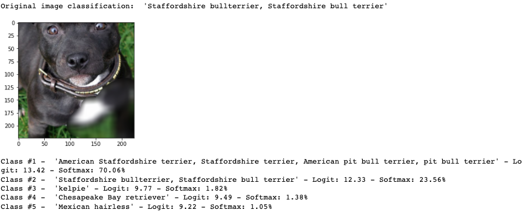

# Interactive Perturbation Visualization Tool
A preliminary interactive perturbation tool that invites users to edit input source images and better understand the attribution problem. This tool is the result of a two-month summer undergraduate research project, and could be subject to more changes in the future.

## Description & Examples
This repository contains two perturbation tools, one showing the result in the form of textual lists, the other visualizes the immediate results after perturbation with a green bar.

Textual List Results             |   Visualization of results
:-------------------------:|:-------------------------:
 |     

## Potential Improvements
*For some originally nonsquare images, the cropping transformation could be more precise. For example, the mud puppy fish from the image dataset originally came in a rectangled shape, and the current transformation crops out its head, which makes subsequent editting more inacurate.

Original Source Image         |   Image after Cropping Transformation
:-------------------------:|:-------------------------:
 |     

*The visualization tool currently only allows users to see the interactive changes that occurs to the original class. A possible improvement would include the top five possible classes, and allow users to observe what happens to the five at the same time, instead of only at one.

## Rreference

## Acknowledgements
This project wouldn't be possible without the supervision and guidance of Dr.Ruth Fong, as well as collboration with Zohra Boumhaout.